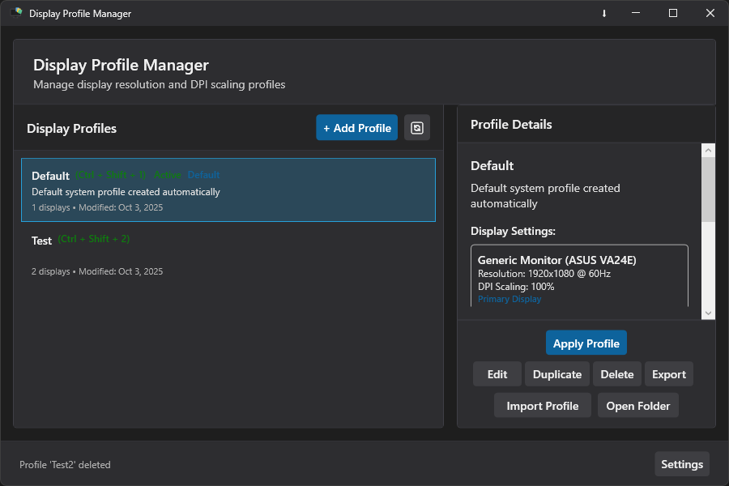
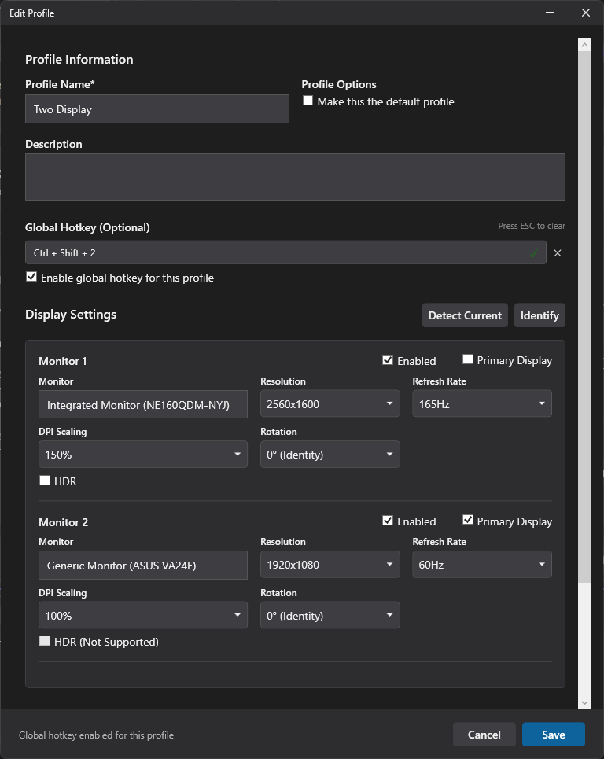
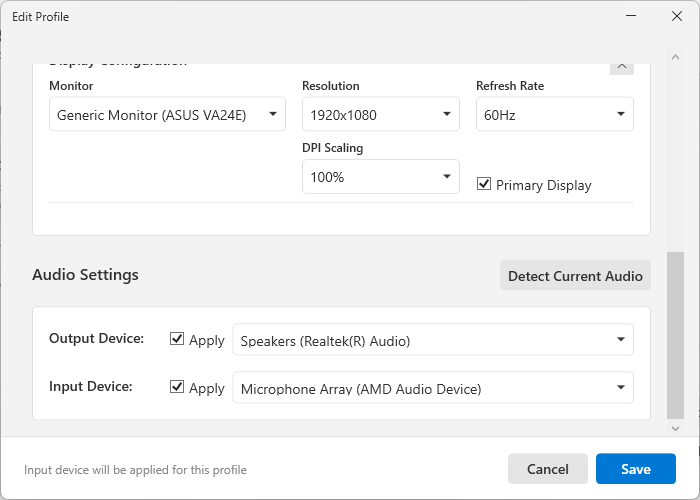
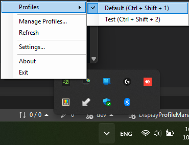
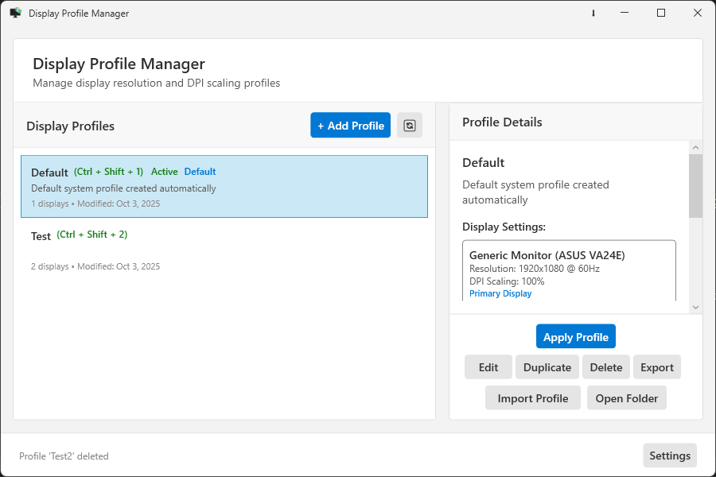

# Display Profile Manager

[](https://www.microsoft.com/windows)
[](https://dotnet.microsoft.com/download/dotnet-framework/net48)
[](LICENSE)
[](https://claude.ai/code)

A lightweight Windows desktop application for managing display profiles with quick switching from the system tray. Perfect for users who frequently change display settings for different tasks or setups.

## ✨ Features

- 🖥️ **Multiple Display Profiles** - Save and manage unlimited display configurations
- 🔄 **Quick Profile Switching** - Change profiles instantly from the system tray
- 📐 **Resolution & Refresh Rate Control** - Adjust display settings per monitor
- 🔍 **DPI Scaling Management** - Control Windows DPI scaling for each profile
- 🚀 **Auto-start with Windows** - Dual modes: Registry (no admin) or Task Scheduler (faster, requires admin setup)
- 🎨 **Modern UI with Theme Support** - Light, dark or system themes
- 💾 **Profile Import/Export** - Backup your configurations
- 🖼️ **Per-Monitor Configuration** - Different settings for multi-monitor setups
- 🔊 **Audio Device Switching** - Automatically switch default playback and recording devices with profiles
- 🔄 **System Tray Profile Switching** - Instantly switch display profiles directly from the system tray
- ⚡ **Global Hotkeys** - Assign keyboard shortcuts to instantly switch between profiles
- 🎯 **Monitor Enable/Disable** - Selectively disable or enable monitors within profiles
- 📍 **Display Position Tracking** - Save and restore monitor positions and arrangements
- 🖥️ **Primary Display Management** - Control which monitor is set as primary
- 📋 **Profile Duplication** - Quickly duplicate existing profiles for easy modifications
- 🔍 **Monitor Identification Overlay** - Visual overlay to identify monitors during configuration
- 🎨 **HDR Support** - Enable/disable High Dynamic Range for HDR-capable displays
- 🔄 **Screen Rotation Control** - Configure screen orientation (0°, 90°, 180°, 270°) per monitor
- 🖥️ **Clone/Duplicate Display Support** - Configure multiple monitors to show identical content (pure clone mode or mixed with extended displays)
- ⚙️ **Staged Application Mode** - Optional two-phase settings application for enhanced stability on complex multi-monitor setups

## 📸 Screenshots

### Main Window

*Manage all your display profiles in one place*



### Profile Editor

*Configure resolution, refresh rate, HDR, rotation, DPI settings for each monitor, hotkey, and audio device preferences*





### System Tray Menu

*Quick access to switch profiles directly from the system tray*




### Light Theme

*Clean light theme for bright environments*




## 📋 Requirements

- **Operating System**: Windows 7 or later
- **.NET Framework**: 4.8 or later ([Download](https://dotnet.microsoft.com/download/dotnet-framework/net48))
- **Privileges**: No administrator rights required for normal operation. Admin needed only for Quick Launch auto-start mode setup.

## 🚀 Installation

1. Download the latest release from the [Releases](../../releases) page
2. Run `DisplayProfileManager.exe`
3. The application will start in your system tray
4. On first launch, your current display settings are saved as the "Default" profile

## 📖 Usage

### Creating a Profile
1. Right-click the system tray icon and select "Manage Profiles"
2. Click "Add New Profile"
3. Configure your desired resolution, refresh rate, HDR, rotation, and DPI settings for each monitor
4. Optionally select default playback and recording audio devices for the profile
5. Choose which audio devices to apply (playback, recording, or both) using the checkboxes
6. Click "Save" to store the profile

### Switching Profiles
- **Quick Switch**: Right-click the system tray icon and select a profile from the list
- **Auto-switch**: Set a default profile to apply on Windows startup

### Managing Settings
- Right-click the system tray icon and select "Settings"
- Configure auto-start behavior:
  - **Registry Mode**: No administrator privileges required, standard startup
  - **Task Scheduler Mode**: Requires admin for initial setup, provides faster launch times
- Choose your default profile to apply on Windows startup
- Toggle between light, dark or system themes
- Configure advanced display settings:
  - **Staged Application Mode**: Enable two-phase profile application for complex multi-monitor setups (improves stability)
  - **Application Pause Duration**: Adjust the delay between phases (1-5000ms)

## 🛠️ Development

### Prerequisites
- Visual Studio 2019 or later
- .NET Framework 4.8 SDK
- Windows SDK

### Building from Source

```bash
# Clone the repository
git clone https://github.com/zac15987/DisplayProfileManager.git
cd DisplayProfileManager

# Restore NuGet packages
nuget restore

# Build the solution
msbuild DisplayProfileManager.sln /p:Configuration=Release

# Run the application
start bin\Release\DisplayProfileManager.exe
```

### Project Structure
```
DisplayProfileManager/
├── src/
│   ├── Core/              # Business logic and profile management
│   │   ├── Profile.cs
│   │   ├── ProfileManager.cs (thread-safe singleton)
│   │   ├── SettingsManager.cs (thread-safe singleton)
│   │   └── HotkeyConfig.cs
│   ├── Helpers/           # Windows API wrappers and utilities
│   │   ├── DisplayHelper.cs
│   │   ├── DisplayConfigHelper.cs
│   │   ├── DpiHelper.cs
│   │   ├── AudioHelper.cs
│   │   ├── AutoStartHelper.cs
│   │   ├── GlobalHotkeyHelper.cs
│   │   ├── ThemeHelper.cs
│   │   ├── LoggerHelper.cs
│   │   └── KeyConverter.cs
│   └── UI/                # WPF views and view models
│       ├── Controls/      # Custom WPF controls
│       ├── Converters/    # Value converters
│       ├── Themes/        # Light/Dark theme resources
│       ├── ViewModels/    # MVVM view models
│       ├── Windows/       # Application windows
│       └── TrayIcon.cs
├── Properties/            # Assembly information and resources
└── docs/                  # Documentation and samples
```

### Architecture

**Core Patterns**
- **MVVM**: ViewModels for UI state management
- **Singletons**: Thread-safe ProfileManager and SettingsManager for global state
- **Async/Await**: All file I/O operations use asynchronous patterns
- **P/Invoke**: Windows Display/DPI/Audio APIs accessed via Helper classes

**UI Framework**
- WPF (.NET Framework 4.8)
- Theme support (Light, Dark, System) via ResourceDictionary

**Storage**
- **Profiles**: Individual `.dpm` files in `%AppData%\DisplayProfileManager\Profiles\` (JSON format)
- **Settings**: `%AppData%\DisplayProfileManager\settings.json` (JSON format)
- **Logs**: `%AppData%\DisplayProfileManager\Logs\` (NLog with daily rotation, 30-day retention)

**APIs & Libraries**
- **Display Management**: Windows Display Configuration APIs (SetDisplayConfig) via P/Invoke for atomic topology changes
- **Audio Management**: AudioSwitcher.AudioApi for device control
- **Logging**: NLog for structured logging with automatic daily file rotation
- **Serialization**: Newtonsoft.Json for profile and settings persistence

### Data Storage

All application data is stored in the user's AppData directory to support standard user privileges:

**Profile Files**
- Location: `%AppData%\DisplayProfileManager\Profiles\`
- Format: Individual `.dpm` files (JSON)
- Each profile is stored as a separate file for easy backup and portability
- Example: `Gaming.dpm`, `Work.dpm`

**Settings File**
- Location: `%AppData%\DisplayProfileManager\settings.json`
- Contains: Theme preferences, auto-start configuration, default profile selection

**Log Files**
- Location: `%AppData%\DisplayProfileManager\Logs\`
- Format: `DisplayProfileManager-YYYY-MM-DD.log`
- Rotation: Daily with 30-day retention
- Useful for troubleshooting display configuration issues

## 🤝 Contributing

Contributions are welcome! Please feel free to submit a Pull Request.

1. Fork the repository
2. Create your feature branch (`git checkout -b feature/AmazingFeature`)
3. Commit your changes (`git commit -m 'Add some AmazingFeature'`)
4. Push to the branch (`git push origin feature/AmazingFeature`)
5. Open a Pull Request

### Reporting Issues
- Use the [Issues](../../issues) page to report bugs
- Include your Windows version and .NET Framework version
- Provide steps to reproduce the issue
- Attach relevant log files if available

## 📝 License

This project is licensed under the MIT License - see the [LICENSE](LICENSE) file for details.

## 🙏 Acknowledgments

- [NLog](https://nlog-project.org/) (v6.0.4, BSD-3-Clause) - Advanced logging framework for .NET with structured logging support
- [Newtonsoft.Json](https://www.newtonsoft.com/json) - JSON serialization
- [AudioSwitcher.AudioApi](https://github.com/xenolightning/AudioSwitcher) (v3.0.0) - Audio device management framework
- [AudioSwitcher.AudioApi.CoreAudio](https://github.com/xenolightning/AudioSwitcher) (v3.0.3) - Windows Core Audio API implementation
- Windows Display Configuration APIs - Display management functionality
- [windows-DPI-scaling-sample](https://github.com/lihas/windows-DPI-scaling-sample) - Provided the foundation for DPI scaling functionality. The original C++ implementation was translated to C# and forms the core of our DpiHelper.cs, enabling reliable system-wide DPI changes. Sample code documentation preserved in docs/sample-code/
- [Claude Code](https://claude.ai/code) - Built in Collaboration with Claude Code. Anthropic's AI assistant helped architect, implement, and refine core features throughout the development process.

For detailed license information about third-party dependencies, see [THIRD-PARTY-LICENSES.md](THIRD-PARTY-LICENSES.md).

### 🤝 Feature Contributors
- [@Catriks](https://github.com/Catriks) - Requested audio device switching functionality ([#1](https://github.com/zac15987/DisplayProfileManager/issues/1))
- [@Alienmario](https://github.com/Alienmario) - Recommended AudioSwitcher.AudioApi library, suggested per-device "Don't change" options ([#1](https://github.com/zac15987/DisplayProfileManager/issues/1)), and reported multi-monitor switching issues ([#5](https://github.com/zac15987/DisplayProfileManager/issues/5))
- [@anodynos](https://github.com/anodynos) - Suggested global hotkey functionality for quick profile switching ([#2](https://github.com/zac15987/DisplayProfileManager/issues/2))
- [@xtrilla](https://github.com/xtrilla) - Requested monitor disable/enable feature for selective display control ([#4](https://github.com/zac15987/DisplayProfileManager/issues/4))
- [@jarandal](https://github.com/jarandal) - Implemented HDR support, screen rotation control, and Staged Application mode with enhanced display configuration engine ([#8](https://github.com/zac15987/DisplayProfileManager/pull/8))
- The open-source community for inspiration and support

---

**Note**: This application runs as a standard user. Administrator privileges are only required when setting up Quick Launch mode for auto-start (uses Windows Task Scheduler).