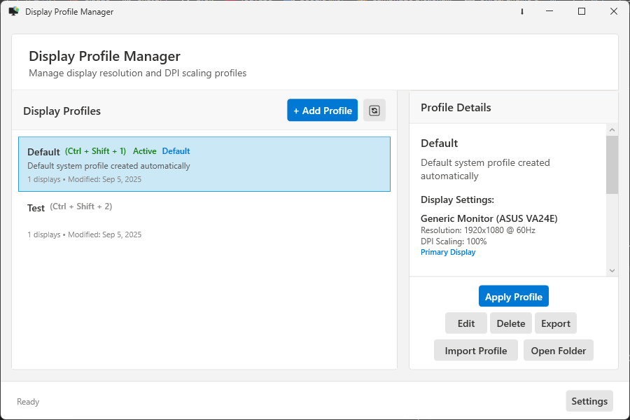
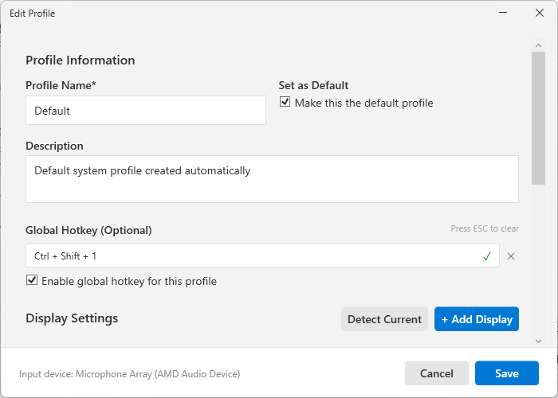
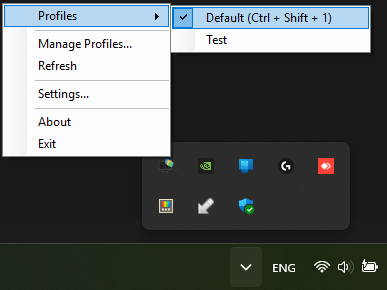
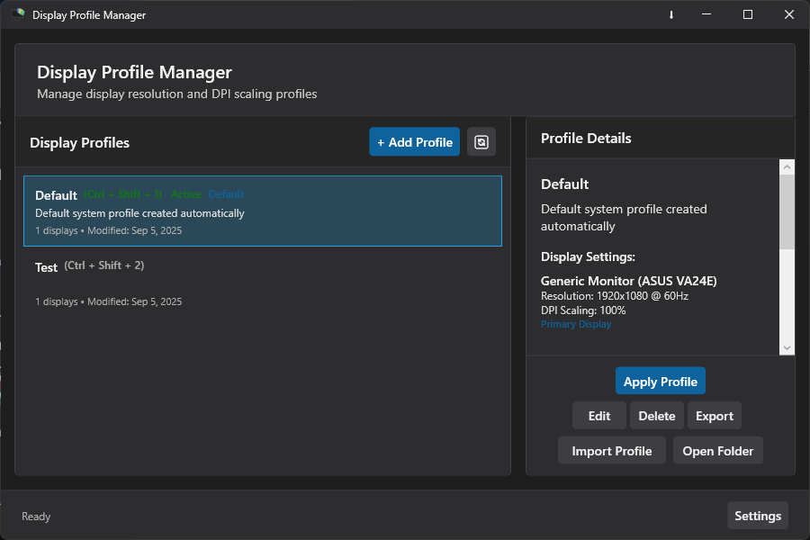

# Display Profile Manager

[](https://www.microsoft.com/windows)
[](https://dotnet.microsoft.com/download/dotnet-framework/net48)
[](LICENSE)
[](https://claude.ai/code)

A lightweight Windows desktop application for managing display profiles with quick switching from the system tray. Perfect for users who frequently change display settings for different tasks or setups.

## ✨ Features

- 🖥️ **Multiple Display Profiles** - Save and manage unlimited display configurations
- 🔄 **Quick Profile Switching** - Change profiles instantly from the system tray
- 📐 **Resolution & Refresh Rate Control** - Adjust display settings per monitor
- 🔍 **DPI Scaling Management** - Control Windows DPI scaling for each profile
- 🚀 **Auto-start with Windows** - Launch automatically and apply your preferred profile
- 🎨 **Modern UI with Theme Support** - Light, dark or system themes
- 💾 **Profile Import/Export** - Backup your configurations
- 🖼️ **Per-Monitor Configuration** - Different settings for multi-monitor setups
- 🔊 **Audio Device Switching** - Automatically switch default playback and recording devices with profiles
- 🔄 **System Tray Profile Switching** - Instantly switch display profiles directly from the system tray

## 📸 Screenshots

### Main Window

*Manage all your display profiles in one place*

### Profile Editor

*Configure resolution, refresh rate, DPI settings for each monitor, and audio device preferences*

### System Tray Menu

*Quick access to switch profiles directly from the system tray*

### Dark Theme

*Modern dark theme for comfortable viewing*

## 📋 Requirements

- **Operating System**: Windows 7 or later
- **.NET Framework**: 4.8 or later ([Download](https://dotnet.microsoft.com/download/dotnet-framework/net48))
- **Privileges**: Administrator rights required (for DPI changes)

## 🚀 Installation

1. Download the latest release from the [Releases](../../releases) page
2. Run `DisplayProfileManager.exe` as administrator
3. The application will start in your system tray
4. On first launch, your current display settings are saved as the "Default" profile

## 📖 Usage

### Creating a Profile
1. Right-click the system tray icon and select "Manage Profiles"
2. Click "Add New Profile"
3. Configure your desired resolution, refresh rate, and DPI settings for each monitor
4. Optionally select default playback and recording audio devices for the profile
5. Choose which audio devices to apply (playback, recording, or both) using the checkboxes
6. Click "Save" to store the profile

### Switching Profiles
- **Quick Switch**: Right-click the system tray icon and select a profile from the list
- **Auto-switch**: Set a default profile to apply on Windows startup

### Managing Settings
- Right-click the system tray icon and select "Settings"
- Configure auto-start behavior
- Choose your default profile
- Toggle between light, dark or system themes

## 🛠️ Development

### Prerequisites
- Visual Studio 2019 or later
- .NET Framework 4.8 SDK
- Windows SDK

### Building from Source

```bash
# Clone the repository
git clone https://github.com/zac15987/DisplayProfileManager.git
cd DisplayProfileManager

# Restore NuGet packages
nuget restore

# Build the solution
msbuild DisplayProfileManager.sln /p:Configuration=Release

# Run the application
start bin\Release\DisplayProfileManager.exe
```

### Project Structure
```
DisplayProfileManager/
├── src/
│   ├── Core/              # Business logic and profile management
│   ├── Helpers/           # Windows API wrappers and utilities
│   └── UI/                # WPF views and view models
├── Properties/            # Assembly information and resources
└── docs/                  # Documentation and samples
```

### Architecture
- **Pattern**: MVVM with singleton managers
- **UI Framework**: WPF (.NET Framework 4.8)
- **Storage**: JSON files in `%AppData%\DisplayProfileManager\`
- **Display APIs**: Windows Display Configuration APIs via P/Invoke
- **Audio APIs**: AudioSwitcher.AudioApi for audio device management

## 🤝 Contributing

Contributions are welcome! Please feel free to submit a Pull Request.

1. Fork the repository
2. Create your feature branch (`git checkout -b feature/AmazingFeature`)
3. Commit your changes (`git commit -m 'Add some AmazingFeature'`)
4. Push to the branch (`git push origin feature/AmazingFeature`)
5. Open a Pull Request

### Reporting Issues
- Use the [Issues](../../issues) page to report bugs
- Include your Windows version and .NET Framework version
- Provide steps to reproduce the issue
- Attach relevant log files if available

## 📝 License

This project is licensed under the MIT License - see the [LICENSE](LICENSE) file for details.

## 🙏 Acknowledgments

- [Newtonsoft.Json](https://www.newtonsoft.com/json) - JSON serialization
- [AudioSwitcher.AudioApi](https://github.com/xenolightning/AudioSwitcher) (v3.0.0) - Audio device management framework
- [AudioSwitcher.AudioApi.CoreAudio](https://github.com/xenolightning/AudioSwitcher) (v3.0.3) - Windows Core Audio API implementation
- Windows Display Configuration APIs - Display management functionality
- [windows-DPI-scaling-sample](https://github.com/lihas/windows-DPI-scaling-sample) - Provided the foundation for DPI scaling functionality. The original C++ implementation was translated to C# and forms the core of our DpiHelper.cs, enabling reliable system-wide DPI changes. Sample code documentation preserved in docs/sample-code/
- [Claude Code](https://claude.ai/code) - Built in Collaboration with Claude Code. Anthropic's AI assistant helped architect, implement, and refine core features throughout the development process.

### 🤝 Feature Contributors
- [@Catriks](https://github.com/Catriks) - Requested audio device switching functionality ([#1](https://github.com/zac15987/DisplayProfileManager/issues/1))
- [@Alienmario](https://github.com/Alienmario) - Recommended AudioSwitcher.AudioApi library and suggested per-device "Don't change" options ([#1](https://github.com/zac15987/DisplayProfileManager/issues/1))
- The open-source community for inspiration and support

---

**Note**: This application requires administrator privileges to modify DPI settings due to Windows security restrictions.